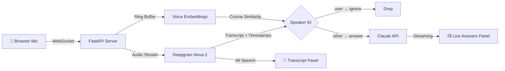
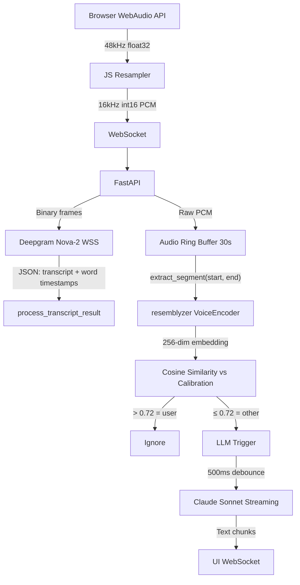

# Conversation Copilot

Real-time AI-powered answer engine for live conversations. Listens to audio, identifies speakers by voice fingerprint, and instantly answers questions asked by other participants — displayed on a second screen as a live teleprompter.

Built with [Deepgram](https://deepgram.com) Nova-2 (streaming STT + diarization), [resemblyzer](https://github.com/resemble-ai/Resemblyzer) (voice-embedding speaker ID), and [Claude](https://anthropic.com) (streaming Q&A).

## How It Works



### Speaker Identification

Unlike basic diarization (which just labels "Speaker 0" vs "Speaker 1"), this system uses **voice embeddings** for speaker identification:

1. **Calibration** — You speak for 5 seconds. The system computes a 256-dimensional voice fingerprint using resemblyzer's neural encoder.
2. **Runtime** — Every utterance's audio is extracted from a ring buffer, embedded, and compared against your fingerprint via cosine similarity.
3. **Classification** — Similarity > 0.72 = you (ignored). Below threshold = someone else (triggers answer generation).

This works even when two people are in the same room at the same mic distance — a scenario where Deepgram's built-in diarization fails.

## Features

- **Real-time Q&A** — Answers stream onto the screen within ~2 seconds of a question being asked
- **Voice-based speaker filtering** — Your voice is ignored; only other voices trigger answers
- **Markdown rendering** — Answers display with **bold**, *italic*, `code`, and bullet formatting
- **Manual trigger** — ⚡ button or `Ctrl+Space` forces an answer on the last utterance from any speaker
- **Post-call summary** — Generates a structured summary of the entire conversation
- **Domain modes** — General, Sales, Legal, and Security prompt presets
- **Meeting context** — Optional context string (e.g., "Q3 review with Acme Corp") that improves answer relevance
- **Zero persistence** — No audio or transcripts are written to disk. Everything is in-memory, session-only.

## UI Overview

The interface is a split-pane teleprompter designed for a second monitor:

```
┌─────────────────────────────────────────────────────────────────────┐
│ COPILOT v1   ● LIVE        [General ▾] [⚡ Trigger] [📋] [■ End]  │
├──────────────────────────────┬──────────────────────────────────────┤
│ LIVE TRANSCRIPT              │ LIVE ANSWERS            ● LISTENING │
│                              │                                      │
│ [YOU]  So tell me about      │ ┌─────────────────────────────┐     │
│        your experience with  │ │ **React** is a JavaScript    │     │
│        React.                │ │ library for building UIs,    │     │
│                              │ │ created by Meta. Key         │     │
│ [THEM] What exactly is React │ │ concepts: components, JSX,   │     │
│        and why do people     │ │ virtual DOM, hooks.          │  ▐  │
│        use it?               │ │                     9:42 PM  │  ▐  │
│                              │ └─────────────────────────────┘     │
│ [YOU]  Well...               │                                      │
│                              │                                      │
├──────────────────────────────┴──────────────────────────────────────┤
│ [Ctrl+Space] Force trigger   [Ctrl+S] Summary     12 utterances    │
└─────────────────────────────────────────────────────────────────────┘
```

- **Left panel** — Live transcript with speaker labels (blue = you, orange = them)
- **Right panel** — AI-generated answers that stream in real-time when the other party speaks
- **Top bar** — Session controls, domain switcher, manual trigger, summary, end/new session
- **Bottom bar** — Hotkey reference, meeting context, utterance count

## Quick Start

### Prerequisites

- Python 3.11+
- [Deepgram API key](https://console.deepgram.com) (free tier works)
- [Anthropic API key](https://console.anthropic.com)

### Install

```bash
git clone https://github.com/4websec/conversation-copilot.git
cd conversation-copilot

# Create virtual environment
python -m venv .venv

# Activate (Windows)
.venv\Scripts\activate
# Activate (macOS/Linux)
# source .venv/bin/activate

# Install dependencies
pip install -r backend/requirements.txt

# Install voice embeddings for speaker identification
pip install resemblyzer
```

### Configure

```bash
cp .env.example .env
# Edit .env with your API keys
```

```env
DEEPGRAM_API_KEY=your_key_here
ANTHROPIC_API_KEY=sk-ant-your_key_here
```

### Run

```bash
cd backend
python main.py
```

Open `http://127.0.0.1:8765` in Chrome.

### Windows One-Click

```powershell
.\start.bat
```

Handles venv creation, dependency install, and server launch automatically.

## Usage

1. **Setup** — Select domain and optional meeting context
2. **Calibrate** — Speak for 5 seconds so the system learns your voice fingerprint
3. **Go Live** — Start your call. Transcript flows on the left; answers appear on the right when the other party speaks
4. **Manual Trigger** — Click ⚡ or press `Ctrl+Space` to force-generate an answer on the last utterance (from any speaker)
5. **End Session** — Click ■ End to generate a post-call summary and reset

### Hotkeys

| Key | Action |
|-----|--------|
| `Ctrl+Space` | Force-trigger answer on last utterance |
| `Ctrl+S` | Generate post-call summary |

## Architecture

```
conversation-copilot/
├── backend/
│   ├── main.py            # FastAPI server, WebSocket handlers, Deepgram relay
│   ├── config.py          # Environment-based configuration
│   ├── speaker_id.py      # Voice-embedding speaker identification (resemblyzer)
│   ├── llm_engine.py      # Claude streaming Q&A engine with trigger logic
│   └── requirements.txt   # Python dependencies
├── frontend/
│   └── index.html         # Single-file React UI (setup → calibration → live → summary)
├── .env.example           # Configuration template
├── start.bat              # Windows one-click launcher
└── README.md
```

### Audio Pipeline



### Key Design Decisions

- **Resampling in JS** — Browsers use native hardware sample rate (44.1/48kHz). Audio is resampled to 16kHz via linear interpolation before sending, avoiding garbled Deepgram output.
- **Ring buffer for voice ID** — 30-second circular buffer maps Deepgram's word-level timestamps back to raw audio for embedding extraction. No separate audio capture needed.
- **500ms trigger debounce** — Prevents rapid-fire LLM calls when someone pauses mid-sentence. Short enough to feel responsive.
- **3-word minimum** — Utterances under 3 words (like "uh huh", "right") don't trigger answers.
- **Streaming answers** — Claude response chunks render as they arrive, sub-second to first token.

## Legal / Consent

Texas is a **one-party consent** state for audio recording. However:

- Calls crossing state lines may require all-party consent (CA, FL, IL, etc.)
- A commercial deployment should make the user responsible for consent compliance via ToS
- Consider adding a built-in "this call is AI-assisted" disclosure feature
- No audio or transcripts are stored to disk in the current implementation

## Configuration

| Variable | Default | Description |
|----------|---------|-------------|
| `DEEPGRAM_API_KEY` | — | Deepgram API key (required) |
| `ANTHROPIC_API_KEY` | — | Anthropic API key (required) |
| `HOST` | `127.0.0.1` | Server bind address |
| `PORT` | `8765` | Server port |
| `LLM_MODEL` | `claude-sonnet-4-5` | Claude model for Q&A |
| `LLM_MAX_TOKENS` | `512` | Max response length |
| `LLM_MIN_WORDS_TRIGGER` | `3` | Min words to trigger answer |
| `TRANSCRIPT_BUFFER_MINUTES` | `3` | Rolling context window |
| `CALIBRATION_DURATION_SEC` | `5` | Voice calibration length |

## Roadmap

- [ ] Electron always-on-top overlay (eliminate need for second monitor)
- [ ] Multi-language support via Deepgram language detection
- [ ] Local Whisper fallback for air-gapped / classified environments
- [ ] Conversation state tracking (topics covered, commitments made)
- [ ] Sentiment / tone indicators on other party's speech
- [ ] Auto post-call summary email via Gmail API
- [ ] Consent management workflow with recording disclosure
- [ ] Web search integration for real-time fact verification

## License

MIT

